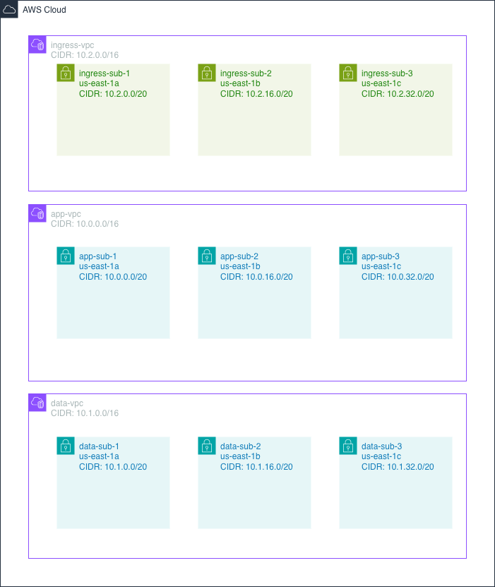
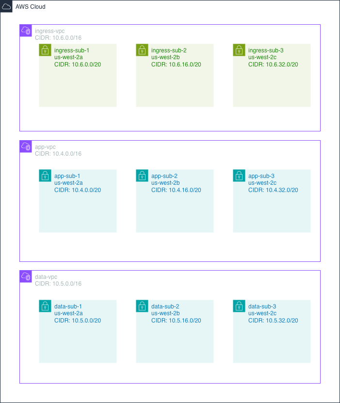
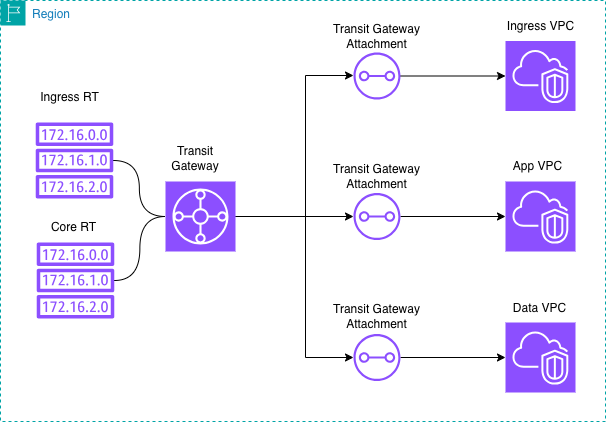

## VPC Schema 

Global CIDR segmentation start with 10.0.0.0/8 

Split by environment
- 10.0.0.0/12 for dev:
    
    Split by region:
    - 10.0.0.0/14 for us-east-1
        
        Split by layer:
        - 10.0.0.0/16 for app
        - 10.1.0.0/16 for data
        - 10.2.0.0/16 for ingress
    
    - 10.4.0.0/14 for us-west-2
        - 10.4.0.0/16 for app
        - 10.5.0.0/16 for data
        - 10.6.0.0/16 for ingress

- 10.16.0.0/12 for staging
- 10.32.0.0/12 for prod

### Schema for us-east-1
The image below shows at a highlevel overview of current setup on us-east-1 region.

### Schema for us-west-2
The image below shows at a highlevel overview of current setup on us-west-2 region.

## Transit Gateway 
On Each region, all VPCs are connected through a Transit Gateway to allow communication among three layers. 
- Ingress -> app
- App -> ingress 
- App -> Database
- Database -> App

The schema looks like this:

